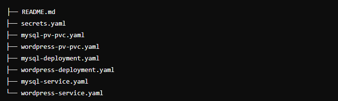
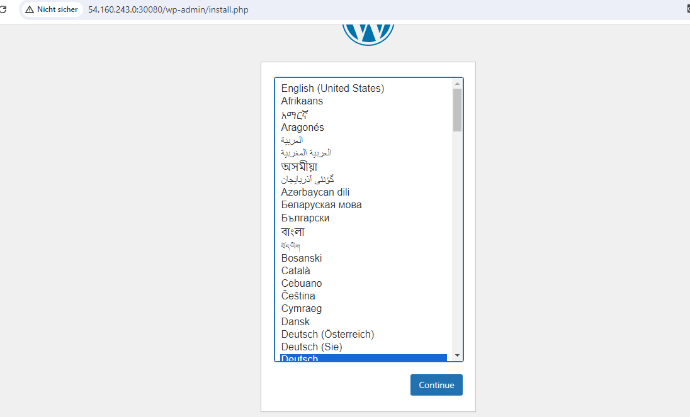
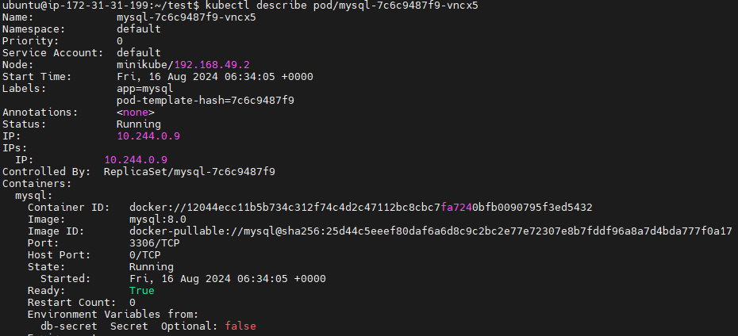
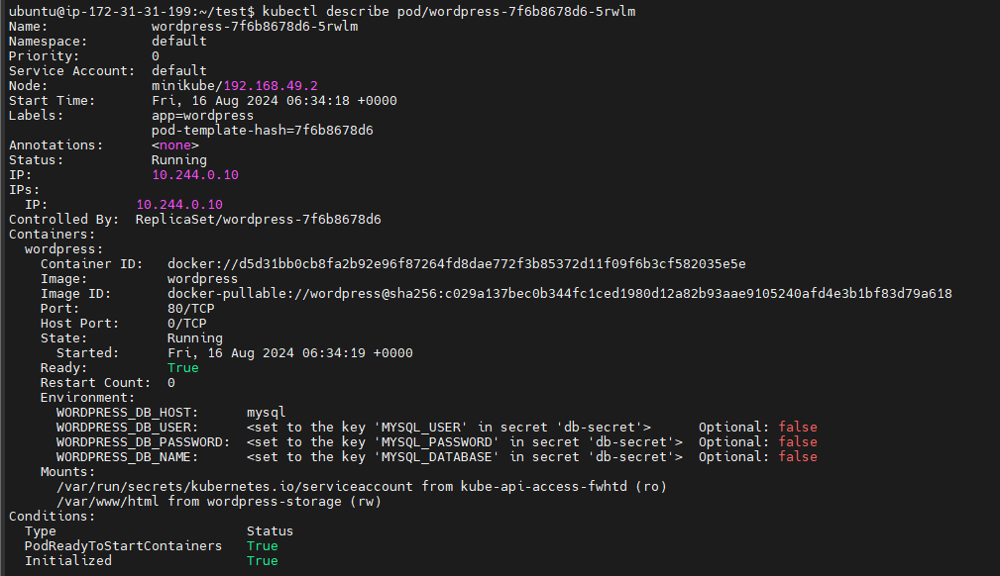

## Firstname : Olivier

## Surname : Djatchue-Tchokothe

## For Eazytraining's 18th DevOps Bootcamp

## Period : march-april-may

# WordPress and MySQL on Kubernetes with Minikube

This repository contains the Kubernetes manifest files for deploying a WordPress application with a MySQL database on a Kubernetes cluster using Minikube. This project demonstrates how to manage stateful applications in a Kubernetes environment, focusing on persistent storage and configuration management.

## Table of Contents

-   [Overview](#overview)
-   [Project Structure](#project-structure)
-   [Manifest Files Explained](#manifest-files-explained)
    -   [Secrets](#secrets)
    -   [Persistent Volumes and Claims](#persistent-volumes-and-claims)
    -   [Deployments](#deployments)
    -   [Services](#services)
-   [Setup](#setup)
    -   [1. Clone the Repository](#1-clone-the-repository)
    -   [2. Start Minikube](#2-start-minikube)
    -   [3. Apply Kubernetes Manifests](#3-apply-kubernetes-manifests)
    -   [4. Access WordPress](#4-access-wordpress)
-   [Screenshots](#screenshots)
-   [Conclusion](#conclusion)


## Overview

This project aims to deploy a WordPress application with a MySQL database using Kubernetes and Minikube. The application uses Persistent Volumes (PVs) and Persistent Volume Claims (PVCs) to handle data storage, ensuring data persistence even if the pod is restarted or redeployed.

## Project Structure

The project is structured as follows:

>

-   **`secrets.yaml`**: Stores sensitive data like database credentials.
-   **`mysql-pv-pvc.yaml`**: Defines both the Persistent Volume and Persistent Volume Claim for MySQL.
-   **`wordpress-pv-pvc.yaml`**: Defines both the Persistent Volume and Persistent Volume Claim for WordPress.
-   **`mysql-deployment.yaml`** and **`wordpress-deployment.yaml`**: Define the deployments for MySQL and WordPress.
-   **`mysql-service.yaml`** and **`wordpress-service.yaml`**: Define the services to expose MySQL and WordPress.

## Manifest Files Explained

### Secrets

The `secrets.yaml` file contains the sensitive information needed by the application, such as database credentials. Storing this information in secrets allows you to manage sensitive data securely in your Kubernetes environment.

#### What Are Secrets?

-   **Purpose**: This file stores confidential information like passwords in a secure way, so it doesn’t appear in plain text in the code.
-   **How It Works**: Secrets are like a safe deposit box that holds the keys to unlock your database and website. It ensures that these keys are not visible to everyone.


```bash
apiVersion: v1
kind: Secret
metadata:
  name: wp-db-secret
type: Opaque
data:
  MYSQL_ROOT_PASSWORD: ZXhhbXBsZXJvb3RwYXNz
  MYSQL_DATABASE: ZXhhbXBsZWRi
  MYSQL_USER: ZXhhbXBsZXVzZXI=
  MYSQL_PASSWORD: ZXhhbXBsZXBhc3M=` 
  ```

**Example Explained**: This code snippet tells Kubernetes to create a safe space called `wp-db-secret` to hold the database password, database name, username, and user password in an encrypted format.

### Persistent Volumes and Claims

The `mysql-pv-pvc.yaml` and `wordpress-pv-pvc.yaml` files define the Persistent Volumes and Persistent Volume Claims for MySQL and WordPress, respectively. These volumes ensure data persistence.

#### What Are Persistent Volumes and Claims?

-   **Purpose**: These files define storage spaces for your data. They ensure that the information in your database and website files doesn't get lost even if your application restarts.
-   **How It Works**: Think of Persistent Volumes as hard drives where your data is stored, and Persistent Volume Claims as the cables that connect these hard drives to your applications.

```bash 
apiVersion: v1
kind: PersistentVolume
metadata:
  name: mysql-pv
spec:
  capacity:
    storage: 2Gi
  accessModes:
    - ReadWriteOnce
  persistentVolumeReclaimPolicy: Delete
  storageClassName: slow
  hostPath:
    path: /data/mysql
---
apiVersion: v1
kind: PersistentVolumeClaim
metadata:
  name: mysql-pvc
spec:
  accessModes:
    - ReadWriteOnce
  resources:
    requests:
      storage: 2Gi
  storageClassName: slow` 
 ```
**Example Explained**: This file sets up a storage space named `mysql-pv` with a capacity of 2 gigabytes for the MySQL database. The claim, `mysql-pvc`, is like the cable that connects this storage to the MySQL application.

**WordPress PV and PVC:**

```bash
apiVersion: v1
kind: PersistentVolume
metadata:
  name: wordpress-pv
spec:
  capacity:
    storage: 2Gi
  accessModes:
    - ReadWriteOnce
  persistentVolumeReclaimPolicy: Delete
  storageClassName: slow
  hostPath:
    path: /data/wordpress
---
apiVersion: v1
kind: PersistentVolumeClaim
metadata:
  name: wordpress-pvc
spec:
  accessModes:
    - ReadWriteOnce
  resources:
    requests:
      storage: 2Gi
  storageClassName: slow
  ```

-   **Example Explained**: This code sets up a similar storage space for WordPress data, ensuring that all website content is securely stored and can be accessed even after a restart.

### Deployments

The deployment files define how to deploy the WordPress and MySQL applications.

#### What Are Deployments?

-   **Purpose**: Deployment files describe how to set up and manage your applications (like WordPress and MySQL) on Kubernetes.
-   **How It Works**: They are like a set of instructions for Kubernetes, telling it what software to run, how many copies to make, and how to connect everything together.

**MySQL Deployment:**
```bash
apiVersion: apps/v1
kind: Deployment
metadata:
  name: mysql
spec:
  selector:
    matchLabels:
      app: mysql
  replicas: 1
  template:
    metadata:
      labels:
        app: mysql
    spec:
      containers:
        - name: database
          image: mysql:8.0
          envFrom:
            - secretRef:
                name: wp-db-secret
          ports:
            - containerPort: 3306
          volumeMounts:
            - name: mysql-data
              mountPath: /var/lib/mysql
      volumes:
        - name: mysql-data
          persistentVolumeClaim:
            claimName: mysql-pvc
```

**Example Explained**: This file tells Kubernetes to run a MySQL database using the information from the `wp-db-secret`. It also specifies that the data should be stored on the `mysql-pvc` storage space.

**WordPress Deployment:**

```bash
apiVersion: apps/v1
kind: Deployment
metadata:
  name: wordpress
spec:
  selector:
    matchLabels:
      app: wordpress
  replicas: 1
  template:
    metadata:
      labels:
        app: wordpress
    spec:
      containers:
        - name: wordpress
          image: wordpress:latest
          env:
            - name: WORDPRESS_DB_HOST
              value: mysql
            - name: WORDPRESS_DB_USER
              valueFrom:
                secretKeyRef:
                  name: wp-db-secret
                  key: MYSQL_USER
            - name: WORDPRESS_DB_PASSWORD
              valueFrom:
                secretKeyRef:
                  name: wp-db-secret
                  key: MYSQL_PASSWORD
            - name: WORDPRESS_DB_NAME
              valueFrom:
                secretKeyRef:
                  name: wp-db-secret
                  key: MYSQL_DATABASE
          ports:
            - containerPort: 80
          volumeMounts:
            - name: wordpress-data
              mountPath: /var/www/html
      volumes:
        - name: wordpress-data
          persistentVolumeClaim:
            claimName: wordpress-pvc

```
 **Example Explained**: This file instructs Kubernetes to set up WordPress, using the same database secrets for login information. It connects the WordPress application to its data storage area using the `wordpress-pvc`.

### Services

The service files expose the deployments to the network, allowing other pods and external users to access them.

#### What Are Services?

-   **Purpose**: Services act like a receptionist or a guide that directs traffic to the right place. They help different parts of the system talk to each other and let users access the applications.
-   **How It Works**: Services ensure that when someone wants to use WordPress or access the MySQL database, they can find and communicate with the correct application.

**MySQL Service:**
```bash
apiVersion: v1
kind: Service
metadata:
  name: mysql
spec:
  selector:
    app: mysql
  ports:
    - port: 3306
      targetPort: 3306
  clusterIP: None
```
**Example Explained**: This service file sets up a connection to the MySQL database. It ensures that the WordPress application knows where to find and how to talk to the MySQL database.

**WordPress Service:**
```bash
apiVersion: v1
kind: Service
metadata:
  name: wordpress
spec:
  selector:
    app: wordpress
  type: NodePort
  ports:
    - port: 80
      targetPort: 80
      nodePort: 30080
```
**Example Explained**: This service file makes the WordPress website accessible from outside the Kubernetes cluster. It sets up a special port (like a door) through which users can visit the WordPress site.

## Setup

### 1. Clone the Repository

Clone this repository to your local machine using the following command:

`git clone https://github.com/your-username/your-repository-name.git
cd your-repository-name` 

### 2. Start Minikube

Start your Minikube cluster:

`minikube start` 

### 3. Apply Kubernetes Manifests

Apply the manifest files in the correct order to deploy the resources to your Minikube cluster:

```bash
kubectl apply -f secrets.yaml
kubectl apply -f mysql-pv-pvc.yaml
kubectl apply -f wordpress-pv-pvc.yaml
kubectl apply -f mysql-deployment.yaml
kubectl apply -f wordpress-deployment.yaml
kubectl apply -f mysql-service.yaml
kubectl apply -f wordpress-service.yaml
```


### 4. Access WordPress

To access the WordPress application, retrieve the Minikube IP address and use the `NodePort` of the WordPress service:

1.  Get the Minikube IP address:
    
    `minikube ip` 
    
2.  Get the `NodePort` of the WordPress service:
 
    `kubectl get svc wordpress` 
    
3.  Open a web browser and navigate to `http://<Minikube_IP>:<NodePort>`.
    

## Screenshots

Here are some screenshots of the application running on Minikube:

1.  **WordPress Login Page:**
>
    
2.  **MySQL Pod Status:**
>
    
3.  **WordPress Pod Status:**
>

## Conclusion

Deploying a WordPress application with a MySQL database on Kubernetes using Minikube showcases the power and flexibility of Kubernetes in managing stateful applications. This project highlights the importance of persistent storage and secure configuration management in a cloud-native environment.
